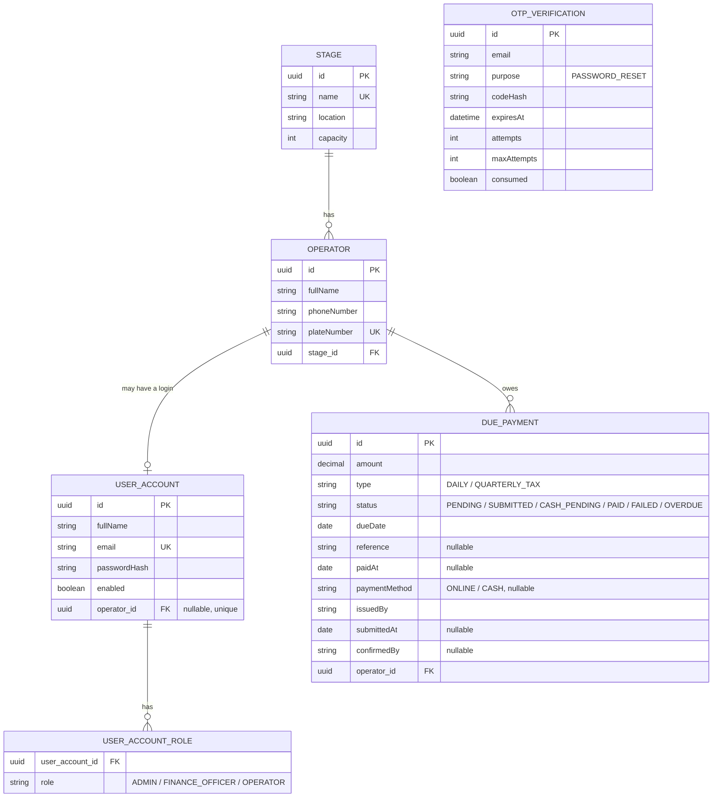

# TransitDues - Project Documentation

This is the formal course-deliverable documentation for TransitDues. It complements,
and deliberately does not repeat, two other documents in this repository:

- [`README.md`](../README.md) - setup instructions and a course-requirement-to-code
  mapping table.
- [`spec.md`](../spec.md) - a running, dated log of what was built, in the order it
  was built, with the reasoning behind non-obvious decisions.

This document instead answers the "why does this project exist and how is it put
together as a whole" questions in one place.

## Table of contents

1. [Problem statement](#1-problem-statement)
2. [Target users](#2-target-users)
3. [Objectives](#3-objectives)
4. [Scope](#4-scope)
5. [Functional requirements](#5-functional-requirements)
6. [Non-functional requirements / quality attributes](#6-non-functional-requirements--quality-attributes)
7. [User stories and acceptance criteria](#7-user-stories-and-acceptance-criteria)
8. [System architecture](#8-system-architecture)
9. [Software development life cycle](#9-software-development-life-cycle)
10. [Domain concepts: actors, processes, data objects](#10-domain-concepts-actors-processes-data-objects)
11. [Data model and database schema](#11-data-model-and-database-schema)
12. [Role-based access control](#12-role-based-access-control)
13. [Authentication and OAuth2](#13-authentication-and-oauth2)
14. [Messaging: RabbitMQ and the email flow](#14-messaging-rabbitmq-and-the-email-flow)
15. [PostgreSQL and MongoDB usage](#15-postgresql-and-mongodb-usage)
16. [Page / API flow](#16-page--api-flow)
17. [Testing plan](#17-testing-plan)
18. [Deployment](#18-deployment)
19. [Known limitations](#19-known-limitations)

## 1. Problem statement

Moto-taxi cooperatives in Kigali collect two kinds of dues from their member
operators: a small daily fee per stage (rank), and a quarterly tax. Today this is
tracked on paper or in ad-hoc spreadsheets per stage, which makes it hard to answer
basic questions reliably - who has paid this month, who is overdue, how much has
actually been collected versus how much is outstanding, and whether a reported cash
payment was ever actually confirmed by anyone accountable. TransitDues replaces that
with a single, auditable ledger shared by every stage in the cooperative.

## 2. Target users

- **Operators** - the moto-taxi riders who owe and pay dues. They need to see their
  own dues and pay them (online or by requesting a cash payment), without seeing
  anyone else's.
- **Finance officers** - collect and confirm payments, issue new dues, and need an
  at-a-glance view of what is expected, collected, and outstanding.
- **Administrators** - oversee the cooperative's structure (stages, operators) and
  need full visibility, including the audit trail, without needing to issue dues or
  touch money themselves.

## 3. Objectives

1. Give every operator a single place to see what they owe and pay it.
2. Give finance a reliable, filterable view of collections, with a real
   confirmation step for cash payments (not just an honor system).
3. Make every money-affecting action traceable: who did what, when, to which due.
4. Keep the system usable on a phone, since most operators will never open it on a
   desktop computer.
5. Demonstrate, end to end, a production-shaped stack: a relational store for
   operational data, a document store for audit/event history, a cache for
   read-heavy aggregates, a message broker for decoupled side effects (audit,
   notification, email), and both first-party and third-party (Google) login.

## 4. Scope

**In scope:** stage/operator/account management; the due payment lifecycle
(issue, pay online, request/confirm cash payment, overdue detection); a finance
collections dashboard; role-based access control; Google OAuth2 login for every
role; OTP-backed password reset over email; an audit trail; a REST API alongside
the web UI.

**Out of scope:** a real payment gateway integration (the online payment flow is
explicitly simulated - see [Known limitations](#19-known-limitations)); SMS
delivery (simulated the same way the original notification flow always was);
multi-tenancy across more than one cooperative; a native mobile app (the web UI is
responsive instead).

## 5. Functional requirements

| # | Requirement | Where |
|---|---|---|
| F1 | An operator can self-register with a stage, plate number and phone | `/register` |
| F2 | An operator, finance officer or admin can sign in by email/phone+password, or by Google | `/login` |
| F3 | A signed-in operator sees only their own profile, dues and payment history | `/portal` |
| F4 | An operator can pay a due online (simulated) or request to pay it in cash | `/portal` |
| F5 | A finance officer can issue a due to one or many operators | `/web/duepayments` |
| F6 | A finance officer can confirm or reject a requested cash payment | `/web/duepayments`, `/web/finance` |
| F7 | A finance officer or admin can see expected/collected/outstanding totals and filter dues | `/web/finance` |
| F8 | A due becomes overdue automatically once its due date passes | `OverdueDuePaymentJob` |
| F9 | An operator who forgets their password can reset it via an emailed one-time code | `/forgot-password` |
| F10 | Every state-changing action is recorded in an audit trail | `AuditLogService`, `/web/audit-log` |
| F11 | A REST API exposes the same stage/operator/due-payment data, under the same role rules | `/api/**` |

## 6. Non-functional requirements / quality attributes

These are written to be checkable, not just aspirational:

- **Security**: passwords are BCrypt-hashed, never logged or returned by any
  endpoint; OTP codes are BCrypt-hashed and single-use; every `/web/**` and
  `/portal/**` route is role-gated (verified by the security test suite, not just
  by UI hiding); CSRF protection is on for every state-changing form.
- **Availability of the dashboard under load**: dashboard aggregates are
  Redis-cached for 60 seconds, so repeated views do not re-scan the due-payment
  table.
- **Data integrity**: a due can never be issued twice for the same operator/type/
  date (enforced both at the application layer and by a database unique
  constraint, so a race between two concurrent requests cannot create a
  duplicate); an operator can never pay another operator's due or double-pay one
  already in flight (enforced in the service layer, verified by tests).
- **Responsiveness**: every page uses the same Tailwind-based layout with a
  collapsible sidebar and works down to a 375px-wide phone screen, since most
  operators are expected to use this on a phone.
- **Auditability**: every create/update/delete of a Stage, Operator, UserAccount or
  DuePayment writes an entry to the MongoDB audit log with who, what, when.
- **Testability**: the full test suite (70 tests as of this writing) runs against
  the real local Postgres/Mongo/Redis/RabbitMQ containers, not mocks of them - see
  [Testing plan](#17-testing-plan).

## 7. User stories and acceptance criteria

**As an operator, I want to see my own dues, so I know what I owe.**
- Given I am signed in as an operator, when I open `/portal`, then I see only
  dues belonging to my own operator record, not anyone else's.

**As an operator, I want to pay a due online, so I don't have to visit in person.**
- Given a due of mine is PENDING, OVERDUE or FAILED, when I choose "Pay Online"
  and confirm, then the due becomes PAID (or FAILED, simulating a declined
  payment) and I see the outcome immediately.
- Given a due of mine is already PAID, SUBMITTED or CASH_PENDING, then no pay
  action is available for it (no double payment).
- Given a due belongs to a different operator, when I attempt to pay it directly
  by URL, then I am refused (403), not shown someone else's due.

**As an operator, I want to request a cash payment, so finance can confirm it
when I actually hand over the cash.**
- Given a due of mine is payable, when I request a cash payment, then it becomes
  CASH_PENDING and stays that way until a finance officer acts on it - I cannot
  confirm my own cash payment.

**As a finance officer, I want to confirm a cash payment, so the ledger reflects
money actually received.**
- Given a due is CASH_PENDING, when I confirm it, then it becomes PAID with a
  reference and my name recorded as the confirmer.
- Given I am an ADMIN, not a FINANCE_OFFICER, when I attempt to confirm a cash
  payment, then I am refused (403) - only finance can confirm.

**As a finance officer, I want to see totals and filter the due list, so I can
find what needs attention.**
- Given dues in several states exist, when I open `/web/finance`, then I see
  total expected, total collected, and outstanding balance computed from the
  current data (not a stale cache).
- Given I filter by operator name, stage, status or date range, then only
  matching dues are listed.

**As a user who forgot their password, I want to reset it by email, without
revealing whether an email is registered.**
- Given I request a reset for an email, whether or not it has an account, then I
  see the same generic confirmation message.
- Given I have a valid, unexpired code, when I submit it with a new password,
  then I can sign in with the new password immediately.
- Given I guess wrong five times, then that code is locked out and a new one
  must be requested.

## 8. System architecture

```mermaid
flowchart TB
    Browser["Browser<br/>(operator / finance / admin)"]

    subgraph App["Spring Boot application"]
        direction TB
        Web["Thymeleaf web controllers<br/>(/web/**, /portal/**, /)"]
        Rest["REST controllers<br/>(/api/**)"]
        Sec["Spring Security<br/>form login + Google OAuth2 + RBAC"]
        Svc["Service layer<br/>Stage / Operator / UserAccount /<br/>DuePayment / Collections / Otp / PasswordReset"]
        Pub["Event publishers<br/>DuePaymentEventPublisher / EmailEventPublisher"]
        Con["Event consumers<br/>PaymentAuditConsumer / NotificationConsumer /<br/>EmailSendConsumer"]
    end

    PG[("PostgreSQL<br/>operational data")]
    Mongo[("MongoDB<br/>audit log + payment events")]
    Redis[("Redis<br/>dashboard cache")]
    MQ{{"RabbitMQ<br/>transitdues.events exchange"}}
    Mail[["Mailpit (dev)<br/>real SMTP provider (prod)"]]

    Browser -->|HTTPS| Sec
    Sec --> Web
    Sec --> Rest
    Web --> Svc
    Rest --> Svc
    Svc --> PG
    Svc -->|cache read/evict| Redis
    Svc -->|audit write| Mongo
    Svc -->|publish| Pub
    Pub -->|convertAndSend| MQ
    MQ -->|@RabbitListener| Con
    Con -->|audit event write| Mongo
    Con -->|send| Mail
```

Every mutation to a `Stage`, `Operator`, `UserAccount` or `DuePayment` goes through
the service layer regardless of whether it arrived through a REST controller or a
Thymeleaf web controller, so the audit log, cache eviction and event publishing
happen exactly once, in one place, no matter which door the request came in through.

## 9. Software development life cycle

This project was built incrementally, each stage building on a working previous
one rather than a single big-bang design-then-build pass - the dated entries in
[`spec.md`](../spec.md)'s "Evolution log" are the real record of this:

1. **Requirements** - the course requirements list (see `README.md`'s mapping
   table) plus the domain understanding of what a moto-taxi cooperative actually
   needs, captured as the functional/non-functional requirements above.
2. **Modeling** - the domain model (Stage/Operator/UserAccount/DuePayment/
   OtpVerification in Postgres, AuditLog/PaymentEventLog in Mongo) and the ER/
   architecture diagrams in this document.
3. **Implementation** - done in deliberately small, working increments (UI
   honesty pass -> accounts/roles/registration -> due payment lifecycle ->
   operator pay flow -> finance collections -> OTP/email/Google login), each
   committed separately, each leaving the application runnable.
4. **Testing** - unit tests for service logic, MockMvc-based controller/security
   tests, written alongside each increment rather than at the end (see
   [Testing plan](#17-testing-plan)).
5. **Delivery** - a pull request per the project's git workflow (see
   [Deployment](#18-deployment) and the PR description accompanying this
   documentation).

## 10. Domain concepts: actors, processes, data objects

**Actors**: Operator, Finance Officer, Administrator, Google Identity Provider,
RabbitMQ (as a mediating actor between a request and its side effects), Mailpit/
SMTP provider.

**Processes**: registration, authentication (form and OAuth2), due issuance (single
and bulk), online payment (initiate -> confirm/cancel), cash payment (request ->
confirm/reject), overdue detection (scheduled), password reset (request code ->
verify code -> set new password), audit logging, dashboard/collections
aggregation.

**Data objects**: `Stage`, `Operator`, `UserAccount` + `Role`, `DuePayment` +
`DuePaymentStatus`/`PaymentType`/`PaymentMethod`, `OtpVerification`, `AuditLog`
(Mongo), `PaymentEventLog` (Mongo), `DuePaymentEvent`/`EmailEvent` (in-flight
RabbitMQ messages, not persisted themselves), `DashboardStats`/`CollectionsSummary`
(computed, cached or fresh, never persisted as their own table).

## 11. Data model and database schema



**Constraints and indexes** (all in PostgreSQL, `ddl-auto=update`):

| Table | Constraint / index | Why |
|---|---|---|
| `stage` | unique `name` | two stages can't share a name |
| `operator` | unique `plate_number`; index on `stage_id` | plate numbers are a real-world unique identifier; stage_id is the most common lookup |
| `user_account` | unique `email`; unique `operator_id` | one login per email; an Operator has at most one linked account |
| `due_payment` | unique (`operator_id`, `type`, `due_date`); index on each of `operator_id`, `status`, `due_date` | the core "no duplicate due" rule, backed by a DB constraint as the race-condition backstop; the three indexes back the list/filter/overdue-job queries |
| `otp_verification` | index on (`email`, `purpose`, `consumed`) | the exact lookup `OtpService` does on every generate/verify |

MongoDB (`audit_logs`, `payment_events` collections) is unconstrained by design -
see [PostgreSQL and MongoDB usage](#15-postgresql-and-mongodb-usage) for why.

## 12. Role-based access control

Three roles, exactly one per account: `ADMIN`, `FINANCE_OFFICER`, `OPERATOR`,
enforced centrally in `UserAccountService.save(...)` (throws if an account would
hold anything other than exactly one role).

| Area | ADMIN | FINANCE_OFFICER | OPERATOR |
|---|---|---|---|
| Dashboard, Stages, Operators | read/write | read/write (Operators read-only) | - |
| Due Payments (view) | yes | yes | own only, via `/portal` |
| Due Payments (issue / bulk issue / edit) | - | yes | - |
| Pay own due (online / request cash) | - | - | yes |
| Confirm / reject cash payment | - | yes | - |
| Collections dashboard (`/web/finance`) | read | read/write | - |
| Audit log | yes | - | - |

Enforced at two levels: a URL-pattern rule in `SecurityConfig` (coarse: which
roles can reach `/web/duepayments/**` at all) and `@PreAuthorize` on individual
mutating methods (fine: e.g. ADMIN can view due payments but not issue them). The
`/api/**` REST controllers carry the same `@PreAuthorize` rules as their `/web/**`
equivalents. Ownership checks that cannot be expressed as a role (an operator
acting only on their own due) are enforced in the service layer and throw
`AccessDeniedException`, which Spring Security routes to the same styled
`/access-denied` page as a role failure.

## 13. Authentication and OAuth2

Two independent ways to authenticate, both producing the same kind of
`Authentication` principal:

1. **Form login** (`/login`): email-or-phone + password, checked against
   `UserAccount.passwordHash` (BCrypt) via `CustomUserDetailsService`.
2. **Google OAuth2/OIDC** (`/oauth2/authorization/google`): `OAuth2UserRoleMapper`
   decides the resulting role(s) in order - an existing account's own DB role,
   then the `OAUTH_ADMIN_EMAILS`/`OAUTH_FINANCE_EMAILS` lists, then an
   auto-provisioned restricted OPERATOR account. See `spec.md` Session 7 for the
   full reasoning; the short version is that Google can never grant ADMIN or
   FINANCE_OFFICER on its own, only an existing database account or the two
   configured email lists can.

`RoleBasedAuthenticationSuccessHandler` routes a freshly authenticated session to
`/` (ADMIN/FINANCE_OFFICER) or `/portal` (OPERATOR-only), regardless of which of
the two methods was used.

## 14. Messaging: RabbitMQ and the email flow

One topic exchange, `transitdues.events`, with two routing-key families:

- `duepayment.*` -> `transitdues.payment-audit.queue` (writes a `PaymentEventLog`
  to Mongo) and `transitdues.notification.queue` (logs a simulated SMS/email -
  this is the original, still-simulated notification path, left in place).
- `email.*` -> `transitdues.email.queue` -> `EmailSendConsumer`, which sends a
  **real** email via `JavaMailSender`. In development this goes to Mailpit
  (`docker-compose.yml`, UI at `http://localhost:8025`); in production it would
  point at a real SMTP provider via the `MAIL_*` environment variables.

Concretely, for a password reset: `PasswordResetService.requestReset(...)` calls
`OtpService.generate(...)` (hashes and stores the code), then
`EmailEventPublisher.publish(...)` (fire-and-forget: a publish failure is logged,
never fails the request). `EmailSendConsumer` picks the message up asynchronously
and sends it. The HTTP response the user sees ("a code has been sent") does not
wait for the email to actually leave the building - this is the normal,
intentional trade-off of decoupling via a message broker.

## 15. PostgreSQL and MongoDB usage

- **PostgreSQL** holds every record that has referential integrity requirements
  and is queried relationally: `Stage`, `Operator`, `UserAccount`, `DuePayment`,
  `OtpVerification`. This is "the ledger" - it must never lose a row or allow a
  duplicate due.
- **MongoDB** holds append-only, schema-light event history: `AuditLog` (one row
  per mutation, across every entity type) and `PaymentEventLog` (one row per
  due-payment state transition, fed by the RabbitMQ consumer, also what the
  operator portal's "Recent Payments" panel reads). Neither needs foreign keys or
  transactions across documents, and both benefit from not needing a schema
  migration every time a new event field is added - exactly the shape NoSQL
  documents handle well that a normalized relational table would not.

## 16. Page / API flow

```
Registration/Login
  -> Role-based redirect (ADMIN/FINANCE_OFFICER -> /, OPERATOR -> /portal)
  -> Operator portal (own dues + Pay Online / Pay Cash)
  -> Due payment lifecycle (PENDING -> SUBMITTED/CASH_PENDING -> PAID/FAILED)
  -> Finance confirmation (cash payments only; online resolves itself)
  -> RabbitMQ event (audit log write + simulated/real notification)
  -> PostgreSQL (source of truth) + MongoDB (event/audit history)
```

Every `/web/**`/`/portal/**` page and its `/api/**` equivalent go through the same
service-layer methods, so this flow is identical regardless of which the request
used.

## 17. Testing plan

**Approach**: this project does not use embedded or mocked databases for its
integration tests - `@SpringBootTest` tests run against the real local
Postgres/Mongo/Redis/RabbitMQ containers started by `docker-compose.yml` (a
deliberate choice recorded in `spec.md`, kept consistent through this session's
additions). Pure business-logic tests use Mockito instead of a real database,
since they are testing a single class's decisions, not integration.

| Category | Example classes | What it covers |
|---|---|---|
| Service unit tests | `DuePaymentServiceImplTest`, `CollectionsServiceTest`, `OtpServiceTest`, `PasswordResetServiceTest`, `UserAccountServiceTest`, `OperatorServiceImplTest`, `RegistrationServiceTest` | business rules in isolation: duplicate-due rejection, payment state transitions and ownership checks, OTP expiry/attempts/single-use, password-reset's no-enumeration behavior, single-role enforcement, plate normalization |
| Security/RBAC (controller) tests | `DuePaymentWebControllerSecurityTest`, `PortalWebControllerSecurityTest`, `FinanceWebControllerSecurityTest`, `AccessDeniedPageTest` | a role that should be refused a route actually gets a 403, not just a hidden button |
| Validation/behavioral controller tests | `PasswordResetWebControllerTest` | public reachability, and that an unknown-email reset request behaves identically to a known one |
| Infrastructure/startup tests | `OverdueDuePaymentJobTest`, `LegacyDuePaymentMigrationRunnerTest`, `RoleConflictRepairRunnerTest`, `OAuth2UserRoleMapperTest`, `CustomUserDetailsServiceTest` | scheduled/startup jobs and authentication wiring behave correctly in isolation |
| Application context test | `TransitDuesSpringBootApplicationTests` | the whole application wires up and starts |

Running it: start the containers (`docker compose up -d`), then `mvn test`. As of
this session, **all 70 tests pass**. This was run and verified, not assumed - the
exact command and output are part of this session's transcript, not claimed
without having actually executed it. One of those validation tests
(`forgotPasswordRejectsAMalformedEmail`) caught a real bug while being written - a
Thymeleaf page evaluating `!submitted` before the controller ever set `submitted`
on its validation-failure path - fixed in `PasswordResetWebController` the same
session it was found.

Beyond the automated suite, every new feature in this session (operator pay flow,
cash confirmation, finance collections, password reset, Google-login
auto-provisioning) was also exercised manually end-to-end through a real browser
against the real local stack: registering an operator, issuing a due as finance,
paying it online, requesting and confirming a cash payment, filtering the
collections page, and completing a password reset via the actual email that
arrived in Mailpit.

## 18. Deployment

Local/dev deployment (what this repository is set up for):

1. `docker compose up -d` - starts Postgres, MongoDB, Redis, RabbitMQ, Mailpit.
2. Copy `.env.example` to `.env`, fill in real values (see the file's comments -
   most have safe local defaults already).
3. `mvn spring-boot:run` (or run `TransitDuesSpringBootApplication` from an IDE).
4. The app is on `http://localhost:8080`; RabbitMQ's management UI on `:15672`;
   Mailpit's UI on `:8025`.

A production deployment would additionally need: a real SMTP provider (replacing
Mailpit via the `MAIL_*` variables), a real Google OAuth2 client registered for
the production domain, TLS termination in front of the app (the app itself serves
plain HTTP), and the database containers replaced with managed, backed-up
equivalents rather than local Docker volumes. None of that infrastructure work was
in scope for this course project - see [Known limitations](#19-known-limitations).

## 19. Known limitations

- **No real payment gateway.** "Pay Online" is a simulated outcome
  (`app.payments.simulated-failure-rate`, default 0.0 i.e. always succeeds). This
  was a deliberate, documented trade-off (see spec.md Session 5/P4) rather than an
  oversight - integrating a real provider was out of scope for this course
  project, but the code is structured so a real gateway call could replace the
  simulation in `DuePaymentServiceImpl.confirmOnlinePayment` without changing any
  other layer.
- **SMS is still simulated** (logged, not sent) - only the email channel was
  made real in this session (P6); SMS delivery was never real even before this
  session and remains out of scope.
- **Single cooperative.** There is no tenant/organization concept; every stage
  belongs to the same cooperative.
- **No production secrets management.** `.env` is the only mechanism for
  secrets locally; a real deployment would use a secrets manager instead.
